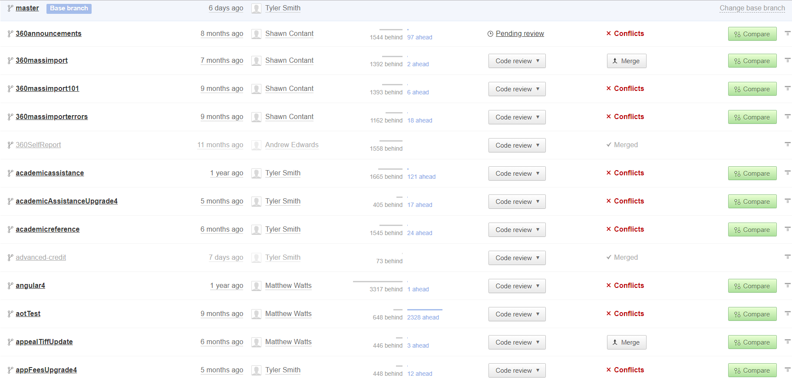
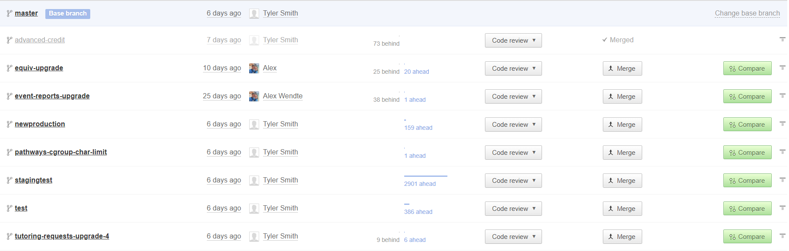

# The Git Survival Guide

## Introduction

Don't get git? I didn't either. My journey with git has been similar to most people. I started out just using git to store my personal projects on a remote repository through `git add`, `git commit`, and `git push`. When I started my first web development job I was overwhelmed by their git workflow and the added complexity that came with it. I learned more about git in that first week then I learned in a whole year of building my own apps. I started to research the best way to maintain a clean git history and how to use git to its fullest potential. There are several commands I have found myself using very frequently that have made my git workflow much smoother. I figured I would share with git newcomers a collection of the commands I use every day in order to help facilitate their git productivity at work.I hope this will also be an excellent resource for git veterans when they forget syntax or want to explore different ways of accomplishing the same task.

If you are new to git I recommend reading my recent post [Understanding Git](./understanding-git.md) before reading the commands below as it will help give context for why we need to use the commands.

Before we get started, here is an image that will help to visualize the different stages changes can be in.


The working directly is essentially what you actually see when you open a file. If you make changes to a file, those changes are in the working directly but no where else. In order to get changes to the staging area, you must notify git of those changes by using `git add <path-to-changes>`. Then, in order to include those changes that have been elevated to the staging area, you use `git commit -m "<you-commit-message>"`. Each of these commands will be explained further in their corresponding sections.

## Table of Contents

- [The Git Survival Guide](#the-git-survival-guide)
	- [Introduction](#introduction)
	- [Table of Contents](#table-of-contents)
	- [Essential Git Commands](#essential-git-commands)
		- [Git Add](#git-add)
		- [Git Commit](#git-commit)
		- [Git Status](#git-status)
		- [Git Diff](#git-diff)
		- [Git Log](#git-log)
		- [Git Push](#git-push)
		- [Git Pull](#git-pull)
		- [Git Clone](#git-clone)
		- [Git Checkout](#git-checkout)
		- [Git Reset](#git-reset)
		- [Git Merge](#git-merge)
		- [Git Branch](#git-branch)
		- [Git Stash](#git-stash)
		- [Git Reflog](#git-reflog)
	- [Advanced Git Commands](#advanced-git-commands)
		- [Git Rebase](#git-rebase)
		- [File Specific "Merge"](#file-specific-merge)
		- [Amend a Commit](#amend-a-commit)
		- [Comparing Commits (..)](#comparing-commits-)
		- [Remove Cached Git Files](#remove-cached-git-files)
	- [Bonus Tips](#bonus-tips)
		- [Git Aliases](#git-aliases)
		- [Git Flow Workflow](#git-flow-workflow)
	- [References](#references)

## Essential Git Commands

### Git Add

Usage

```
// adds everything at and below current console directory
git add .
```

```
// adds a specific directory or path relative to current console directory
git add <path(s) to directory or file(s)>
```

<details><summary>Explanation</summary><p>

`git add` is used to elevate the changes you chose from your working directory (where you are adding code and deleting code) into the staging area. The staging area is where you put code before you are ready to actually save it by using git commit. When there are a lot of changes that are made it is handy to be able to look at the changes one file at a time and after you are satisfied with the file's changes, you you can add it to the staging area.

Remember this image from the introduction, and how `git add` elevates the files you chose in your working directory to be a part of the staging area.


</p></details>

### Git Commit

Usage

```
// saves the changes in the staging area into a commit with a message
git commit -m "updates React to version 16.6.1"
```

<details><summary>Explanation</summary><p>

`git commit` is used to take the changes in the saving area and save them so that you can come back to the changes at a later time. This enables you to easily see the line-by-line differences between various commits and branches.

**NOTE** Commits are essential to a clean and easy to understand git repository. It is extremely important that you provide clear commit messages detailing the changes you made. If one of your coworkers looks at your commit messages they should be able to see how each commit affected the codebase. You don't need to go into specific code changes, they can look at the `git diff` for that, but the message should be a clear summary about the work you did.

Remember this image from the introduction, and how `git commit` elevates the files in the staging area to be a part of the repository.


</p></details>

### Git Status

Usage

```
git status
// output ↓
→ On branch master
→ Your branch is up to date with 'origin/master'.
→
→ Changes to be committed:
→  (use "git reset HEAD <file>..." to unstage)
→
→        modified:   git-survival-guide.md
```

<details><summary>Explanation</summary><p>

`git status` shows you the state of your current branch. It will show you changes that are in the working directory, changes that are in the staging area, files that were deleted, what branch you are on, your current relation to the upstream branch, and several other things.

</p></details>

### Git Diff

Usage

```
// shows the differences in the current working directory against HEAD (normally the last commit)
git diff
```

```
// show the differences in the specified files against HEAD
git diff <path(s) to directory or file(s)>
```

<details><summary>Explanation</summary><p>

`git diff` is one of the most helpful commands for ensuring the changes you made were intentional. The output of git diff can take some getting use to to understand. Basically git diff shows you is the difference between the lines that were changed. You will see "+" next to lines that were added relative to HEAD and "-" next to lines that were deleted relative to HEAD.

view [Diffing Branches](#diffing-branches) for viewing the differences between git branches.

</p></details>

### Git Log

Usage

```
git log
// output ↓
→ commit 1ee872ab45d5eb69fd668720d2435f8da38881b3 (HEAD → master, origin/master)
→ Author: Alex <alex@wendtedesigns.com>
→ Date:   Tue Nov 13 20:51:57 2018 -0600
→
→     adds git diff
→
→ commit 2adc818d3c076bfaa5837d5fc03eefe19921bf52
→ Author: Alex <alex@wendtedesigns.com>
→ Date:   Tue Nov 13 20:40:04 2018 -0600
→
→     adds expand to each explanation section
```

<details><summary>Explanation</summary><p>

`git log` shows you your commit history. **TIP** Make sure you press "q" to get out of `git log` and not "ctrl + c". "ctrl + c" will sometimes mess up your terminal.

Look at [Comparing Commits (..)](#comparing-commits) for an even more useful feature of `git log`.

</p></details>

### Git Push

Usage

```
// pushes your local commits to the upstream branch (normally origin master)
git push
```

<details><summary>Explanation</summary><p>

`git push` will take the changes up to your current HEAD and push them to the branch you have set as your upstream branch. This is commonly a remote branch hosted on GitHub

The upstream branch is set by using `git push --set-upstream <remote-repository-url> <branch-name>`

</p></details>

### Git Pull

Usage

```
// pull down the commit history from the upstream branch
git pull
```

<details><summary>Explanation</summary><p>

`git pull` will take the changes from the upstream branch and create a new commit on your local branch applying those changes.

**NOTE**
You can use `git pull --rebase` to attempt to `rebase` the remote changes onto your current branch and **NOT** produce a new git commit. This is what I usually do to maintain a cleaner git history

</p></details>

### Git Clone

Usage

```
// clones the repository into your current directory
git clone <your-remote-repository>
```

-

<details><summary>Explanation</summary><p>

`git clone` is used to take a remote git repository, which can be online or simply in a different directory, and make it a local repository that you can interact with like any other repository. The remote repository remains unchanged.

</p></details>

### Git Checkout

Usage

```
// will reset changes from the working directory back to the current commit's status
git checkout <path-to-files>
```

```
// change HEAD (and the working directory) to the specified branch
git checkout <branch-name>
```

<details><summary>Explanation</summary><p>

`git checkout` has many different use cases. One common one is to reset any changes you have made since the last commit. I use it to clear out the changes I made on files I didn't mean to touch before committing. In order to remove files that were newly added to the working directory you need to use `git clean -fd` to remove them.

A second use case if for checkout out to different branches. You can create a new branch using `git checkout -b <new-branch-name>` or checkout an existing branch using `git checkout <existing-branch-name>`

If you are curious of the state of the codebase at a certain commit, you can directly checkout that commit using `git checkout <git-commit-hash>`. This leaves you in a "detached head" state where your working directory is set to the checkout out commit's files, and any changes or commits you make will not be saved.

If we look at this image, `git checkout` can remove changes from the working directory and take you back to a clean slate of the last commit, essentially bumping you up one level in the image.


</p></details>

### Git Reset

Usage

```
// will move any staged files in the specified path(s) back to the working directory
git reset <path-to-files-to-reset>
```

```
// will move head back 3 commits, but will keep the working directory intact
git reset head~3
```

<details><summary>Explanation</summary><p>

`git reset` is an extremely useful, but a potentially dangerous command. Atlassian says, "Care must be taken when using this tool, as it’s one of the only Git commands that have the potential to lose your work." We will explore that in a second, but for now what you need to know is that git reset has 2 main functionalities.

It can be used to take changes that have been elevated to the staging area and bumping them back down to the working directory.

`git reset` is also used to affect commit history, and this is where it can become dangerous. A common situation I use git reset is when I have really messed up a rebase or a merge. When this happens, I use [git reflog](#git-reflog) to see the reference to the commit before I messed thing up, then run `git reset HEAD@{<number>}` in order to get my commit history back in line. After this, I will run `git checkout .` in order to clear my working directory of leftover changes from the messed up merge.

If we look at this image, `git reset` can remove changes from the staging area and place them back into the working directory level.


view [Git Reset](https://www.atlassian.com/git/tutorials/undoing-changes/git-reset) by Atlassian for a full explanation of `git reset`.

</p></details>

### Git Merge

Usage

```
//  take the changes from the branch you want to include and attempt to bring them into the currently checkout out branch
git merge <branch-name>
```

<details><summary>Explanation</summary><p>

`git merge` allows you to take the changes from a branch and bring them into your currently checkout out branch. This is where git can become confusing for many people as "merge conflicts" arise. A merge conflict happens when your currently checked out branch has made a change on the same line of code that the branch you are merging in has made. Read [Git Merge](https://www.atlassian.com/git/tutorials/using-branches/git-merge) for an awesome in detail explanation of why merge conflicts happen.

In general, it is best practice to try to avoid merge conflicts. Using an effective git workflow can help with this, as well as making sure you keep any branches up to date with the master branch. One of my least favorite tasks at work is sorting through a whole terminal of files filled with merge conflicts.

On a side note, using style tools such as prettier and linting tools such as eslint can helps significantly reduce merge conflicts that occur because of simple changes in formatting.

`git merge -X theirs` uses "their" (the branch you are merging in) changes if there are merge conflicts whenever possible.

</p></details>

### Git Branch

Usage

```
// creates a new branch off of the currently checkout out branch
git checkout -b <branch-you-want-to-create>
```

<details><summary>Explanation</summary><p>

`git branch` is an essential aspect to a clean git workflow. It enables you to create a copy of the currently checkout out branch and commit and make changes on a new branch that do not affect the branch you checkout out from. Whenever you are satisfied with the changes you have made on the branch, you can checkout the original branch again, and then `git merge <branch-you-created-out>`

[Git Flow Workflow](https://www.atlassian.com/git/tutorials/comparing-workflows/gitflow-workflow) makes heavy and effective use of git branching. Read the linked article for how to use it effectively.

It is easy to get out of control with git branches. Using a git workflow will help to eliminate situations like this 

As you can see, there are way too many git branches (and there are at least 15 more), and many of them are months or years out of date. This makes managing a project much more difficult. It is a better idea to have a git repository looking like this 

This looks better because there are not as many branches, they are more in-sync with the master branch. This conversion from the first image to the second happened through deleting branches after they were merged into master because they were no longer needed. This can be done locally by using `git branch -d <branch-name>` or remotely by using `git push origin :<branch-name>`

</p></details>

### Git Stash

Usage

```
// save the current working director in to the git stash
git stash
```

```
// apply the stashed changes to the current working directory
git stash apply
```

<details><summary>Explanation</summary><p>

`git stash` is used to save the changes in your current working directory to use later if you need a clean working directory before running a different git command.

You can get a list of stashes by using `git stash list`

You can choose which stash you want to apply by using `git stash apply stash@{<number>}`

</p></details>

### Git Reflog

Usage

```
git reflog
// output ↓
b1d13e5 (HEAD -> about-us, origin/about-us) HEAD@{0}: commit: starts about page. decreases boldness of links. creates annualreports for about
274d1ec (origin/develop, develop) HEAD@{1}: checkout: moving from develop to about-us
274d1ec (origin/develop, develop) HEAD@{2}: commit: version 0.7.1
33e51f8 HEAD@{3}: rebase -i (finish): returning to refs/heads/develop
33e51f8 HEAD@{4}: rebase -i (fixup): improves coverage threshold to 95,75,95,95. implements futher tests in multiple components. refactors and fixes header focus and hover functionality.
4071888 HEAD@{5}: rebase -i (reword): improves coverage threshold to 95,75,95,95. implements futher tests in multiple components. refactors and fixes header focus and hover functionality.
95e4d95 HEAD@{6}: rebase -i: fast-forward
01adb5c HEAD@{7}: rebase -i (start): checkout head~3
8eae4d5 (origin/coverage-and-header-fix, coverage-and-header-fix) HEAD@{8}: merge coverage-and-header-fix: Fast-forward
```

<details><summary>Explanation</summary><p>

`git reflog` shows the exact history of the commands git has used along with head references and commit hashes. It is an extremely useful command whenever you mess up your branch with git reset, git merge, or git rebase. in order to go back to a specific commit, use `git reflog` to find the reference point, and then `git reset HEAD@{<head-number-to-reset-to>}` and git will take you back to where you were at that reference point.

</p></details>

## Advanced Git Commands

### Git Rebase

Usage

```
// open a file showing you the last 3 commits enabling you to chose what to do with them
git rebase -i HEAD~3
// partial output ↓
pick ed12574 moves works cited to correct section
pick 5a3a0d2 adds git push, pull, and additional tips
pick 60a40e3 adds merge and headers to understanding git
```

<details><summary>Explanation</summary><p>

`git rebase` enables you to completely rewrite your git history. It is best practice to do this on commits that do not currently exist in a remote repository on a branch that other people are relying on (such as already existing commits on the master branch). I commonly use this to explain in 1 commit the work I did on a feature branch no one else is touching before I merge back into master.

When you run `git rebase -i HEAD~3` this is the explanation you will be given:

```
pick ed12574 moves works cited to correct section
pick 5a3a0d2 adds git push, pull, and additional tips
pick 60a40e3 adds merge and headers to understanding git

# Rebase 1ea990e..60a40e3 onto 1ea990e (3 commands)
#
# Commands:
# p, pick = use commit
# r, reword = use commit, but edit the commit message
# e, edit = use commit, but stop for amending
# s, squash = use commit, but meld into previous commit
# f, fixup = like "squash", but discard this commit's log message
# x, exec = run command (the rest of the line) using shell
# d, drop = remove commit
#
# These lines can be re-ordered; they are executed from top to bottom.
#
# If you remove a line here THAT COMMIT WILL BE LOST.
#
# However, if you remove everything, the rebase will be aborted.
#
# Note that empty commits are commented out
```

the oldest commit is at the top, and the newest is at the bottom. If I wanted to keep commit `ed12574` and turn commits `5a3a0d2` and `60a40e3` into 1 commit I would save the file and then close it as the following

```
pick ed12574 moves works cited to correct section
pick 5a3a0d2 adds git push, pull, and additional tips
squash 60a40e3 adds merge and headers to understanding git
```

This would keep commit `ed12574` but would take the commit message and changes from commit `60a40e3` and apply them to commit `5a3a0d2` effectively cleaning up our git history.

view [Git Rebase](https://www.atlassian.com/git/tutorials/rewriting-history/git-rebase) by Atlassian for a full explanation of `git rebase`.

</p></details>

### File Specific "Merge"

Usage

```
// include specified files from specified in your current working and staging directories.
git checkout <branch-to-pick-from> <path-to-file(s)>
```

<details><summary>Explanation</summary><p>

I learned this from [this blog post](https://jasonrudolph.com/blog/2009/02/25/git-tip-how-to-merge-specific-files-from-another-branch/) and it has saved me in several nasty situations because my work has several extremely out of date branches, and I only need to pick certain files to include in a feature branch.

</p></details>

### Amend a Commit

Usage

```
// make a change to the previous commit based on your current staging directory with a commit message.
git commit --amend -m <your-new-commit-message>
```

```
// make a change to the previous commit based on your current staging directory without changing the commit message.
git commit --amend --no-edit
```

<details><summary>Explanation</summary><p>

`git commit --amend` helps you when you want to make a change to the previous commit without creating a new commit. Do not use this on a commit that has already been pushed to a remote repository because it rewrites history, and people might be relying on that history.

If you need to amend a commit that is in a remote repository, you can use `git commit --amend` and the force push the changes to the remote repository using `git push --force`

</p></details>

### Comparing Commits (..)

Usage

```
// git the log difference only between master and head
git log master..head
```

```
// get the diff only between master and head
git diff master..head
```

### Remove Cached Git Files

```
// removes all files from git cache. Useful if you add a file to git ignore after git is already tracking it.
git rm --cached .
```

## Bonus Tips

### Git Aliases

Git commands are not very long, but you type them so much that it would be nice to only type 2 letters instead of git pull --rebase.
Git Aliases integrated Bash aliases allow you to do just that. You can easily set up custom aliases to increase your productivity.

View [Git Bash Aliases](http://kurtdowswell.com/software-development/git-bash-aliases/) by Kurt Dowswell for an explanation of how to set up git aliases.

### Git Flow Workflow

It is essential for organizations to be on the same page about how to manage your git workflow. This will guide things such as naming conventions, when to create branches, when to merge branches, production versioning,and many other aspects of a git workflow. I recommendation is to conform to whatever workflow your current organization uses. However, if you working on a personal project or have the opportunity to suggest a workflow, [Git Flow Workflow](https://www.atlassian.com/git/tutorials/comparing-workflows/gitflow-workflow) is very intuitive and helps to reduce merge conflicts.

## References

git levels image: image from imgur.com
